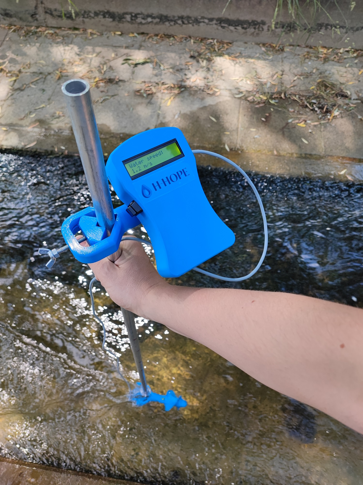
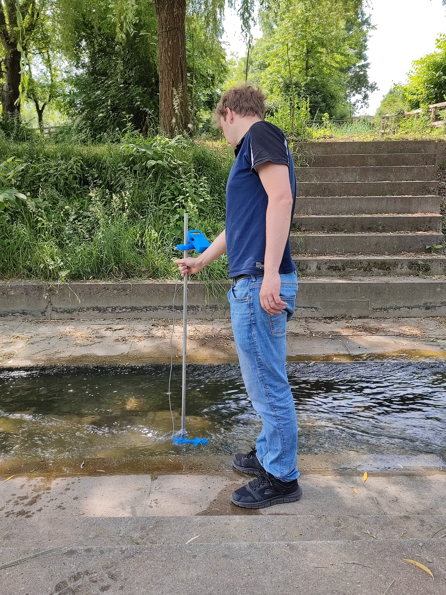

# DIY hydrometric wing for measuring flow velocities 'H-HOPE current meter'
 
 
The hydrometric wing "H-HOPE current meter" was designed and developed as part of a H-HOPE project (web site https://h-hope.eu/). H-HOPE current meter measures water flow velocities on the principle of automatic recalculation of screw rotation frequencies in water velocity through the equation. H-HOPE current meter has been designed to be produced using the DIY (Do-It-Yourself) principle. All parts used for the production of H-HOPE current meter are readily available. H-HOPE current meter can be powered by 9V battery, or by external micro USB cable. H-HOPE current meter can measure water velocity from 0.1 to 5m/s. 
 

 
Figure. H-HOPE current meter.

 
Figure. 3D exploded model of a H-HOPE current meter.

## Table of content

- [Materials and tools,](#material)
- [3D model,](#3dmodel)
- [Arduino code,](#arduino)
- [Assembly and test,](#assembly)
- [Field test.](#fieldtest)

## Material and tools used

The project was designed in a certain way, that the material and tools necessary to build this project is widely available. Most of the parts and tools are available in local technical store or for example on online store Aliexpress. 

### Material used for this project:

- Arduino uno https://www.aliexpress.com/item/1005002707450245.html
- Connectors (XH): https://www.aliexpress.com/item/33000442968.html
- Connecting cables (XH): https://www.aliexpress.com/item/1005002160765607.html
- Micro usb socket: https://www.aliexpress.com/item/1005003730290423.html
- 9v battery holder https://www.aliexpress.com/item/32825539506.html
- 16x2 LCD with i2c header: https://www.aliexpress.com/item/32413056677.html
- Unipolar Hall sensor (SIP package, for exmaple SS443A): https://www.aliexpress.com/item/1005001522952951.html
- Magnet, size 3x1mm: https://www.aliexpress.com/item/1005005222147418.html
- 2m 3-core cable: https://www.aliexpress.com/item/1005002082473369.html
- Pushbutton / toggle ON/OFF switch: https://www.aliexpress.com/item/1005004004236347.html
- XH pin connectors: https://www.aliexpress.com/item/1005004267331222.html
- 6x M2 screws (10mm length)
- 3x M4 screws (30mm length)
- 2x M5 screws with 
- M8 screw (50mm length)
- Epoxy glue
- 9v battery
- micro usb cable
- spring
- Stick, Bar

### Tools needed for this project:

- Soldering iron
- 3D printer
- Set of Screwdrivers

## 3D printing and model of the H-HOPE current meter

We used Prusa MK3S 3D printer to print the H-HOPE current meter plastic parts. Chosen material was PETG.

Below is the 3D exploded model of a H-HOPE current meter. H-HOPE current meter is made from two main parts. 

- assembly of a screw,
- assembly of the enclosure with LCD screen and holder. 

 
Figure. Exploded model of the screw.

 
Figure. Exploded model of the enclosure with LCD screen and holder.

Source files (step file) for printing the H-HOPE current meter are available on [Github](https://github.com/H-HOPE/DIY-Flow-meter/blob/7c3ee1f1fafccab5ecbd7b81c10c78a44afabfad/src/3D%20model/Flowmeter_assembly.stp).

 
Figure. Printing the H-HOPE current meter enclosure.

 
Figure. 3D printed parts for the H-HOPE current meter holder.

## Arduino code

In this chapter the source code for the Arduino Uno microcontroller will be explained.

 
Figure. Arduino uno board is used for H-HOPE current meter electronics.

Arduino code:
https://github.com/H-HOPE/DIY_Flow_meter/blob/e5a896e44799b07652782b1dd13d3e7614e1950c/src/Arduino/H-HOPE_Hi-wing.ino#L1-L63

Key parts of the Arduino code:
- First, we include libraries for LCD screen and I2C protocol. LCD screen library is also available [here](https://github.com/H-HOPE/DIY-Flow-meter/tree/main/src/Arduino/lib).
- Then we define an Arduino pin, where the hall sensor will be connected. In this case, this pin is number 2.
- in lines 13 through 15 we define variables. 
- In the setup section we initialize the LCD screen and configure interrupt for the hall sensor. 
Hall sensor output is connected to the Arduino Uno inetrrupt. Arduino Uno has two external interrupt pins, INT0 and INT1, which are mapped to digital pins 2 and 3 respectively. Interrupts are signals that allow a microcontroller to pause its current execution and handle an event or task that has a higher priority. 
In this case hall sensor is attached to the INT0 pin (digital pin 2).
Configure the interrupt settings using the attachInterrupt() function. This function takes three arguments: the interrupt number (in this case, 0 for INT0), the function to call when the interrupt is triggered (cnt), and the mode in which to trigger the interrupt (on FALLING EDGE).
- In the loop section, from line 38, the code to calculate the water velocity from the screw rotation speed is written. The calculated water velocity is shown on the LCD screen.
- Finally at the end of the program there is an interrupt routine, that records the time when the magnet on the wing passes hall sensor.

 
Figure. Arduino Uno microcontroller mounted in the H-HOPE current meter enclosure.

## Assembly and test

With all the printed parts ready and programmed Arduino, we can start the assembly of the H-HOPE current meter.

3D exploded model of a H-HOPE current meter

 
Figure. 3D exploded model of a screw.

 
Figure. 3D exploded model of the enclosure.

### Enclosure for the H-HOPE current meter electronics

 
Figure. Enclosure for the H-HOPE current meter electronics.

Assembly of the screw:

Mount two bearings in the screw and put the end cap to the screw.

 
Figure. First bearing mount.

 
Figure. Second bearing mount, with end cap.

 
Figure. Assembly of the bar mounting tight screw

 
Figure. Assembled screw holder.

Next, place 1x3 mm magnet in the prefabricated hole in the screw and glue the magnet with Epoxy glue.

 
Figure. Magnet assembly on the screw.

We need to solder hall sensor to the cable. Hall sensor has three pins GND, VCC and Signal

 
Figure. Pinout of the SS443a Hall sensor.

Put the cable through the screw holder and glue the hall sensor, with the Epoxy glue to the screw holder.

 
Figure. Screw with bearing and end cap.

Assembled Screw.

 
Figure. Assembled Screw.

### Assembly of the H-HOPE current meter electronics.

Mount the Arduino Uno in the enclosure, screw the micro USB module to the enclosure with two M2 10mm screws. Connect micro USB module to Arduino Uno (5V to 5V; GND to GND).

 
Figure. Arduino Uno and micro USB module.

Connect hall sensor GND, VCC and OUT to the Arduino Uno

 
Figure. Hall sensor connected to the Arduino Uno.

Mount 16x2 LCD screen with 4 M2 10mm screws to the front of the enclosure. Connect the LCD screen to the Arduino, through the I2C protocol.

 
Figure. LCD screen connection.

Mount 9V battery connector, make small hole for wires. Connect 9v Battery holder to Arduino Uno (+9V battery to Vin Arduino Uno pin; -9V battery to GND Arduino Uno pin)

 
Figure. 9V battery installation.

Make hole on the enclosure for the external ON/OFF switch to power on the H-HOPE current meter. Connect the switch in series with positive battery wire.

 
Figure. External ON/OFF switch.

Use screws to assemble the electronics enclosure of the H-HOPE current meter. 

 
Figure. Mounting screws.

### Holder for the H-HOPE current meter electronics (optional)

It is also possible to mount the H-HOPE current meter electronics with the help of holder to the stick. In that case you need to print and assemble the H-HOPE current meter holder. 

 
Figure. Assembly of the holder for the H-HOPE current meter electronics.

### Test hall sensor response.

Oscilloscope was used to test the output signal from the hall sensor

 
Figure. Hall sensor test setup.

Hall sensor need pull-up resistor to operate properly. You can use external 10k pull-up resistor across the Vcc and hall input pin. In our case we configured Arduino to use his internal pull-up resistor. Then we test the operation of the hall sensor with an oscilloscope.

 
Figure. Hall sensor output signal on oscilloscope.

## Field test

Now you can find a waterway and measure its speed with the H-HOPE current meter water velocity sensor.

 
 
Figure. Image of the H-HOPE current meter water velocity sensor in open channel
 
 

  
  
Figure. Measuring water velocity with the H-HOPE current meter sensor.

&nbsp;
&nbsp;
&nbsp;

